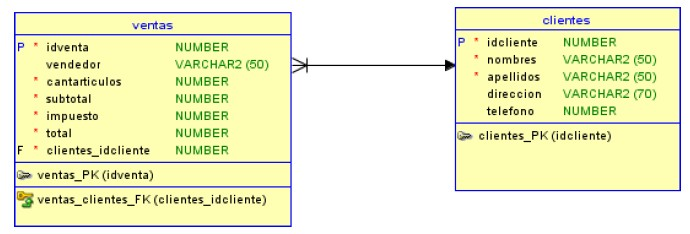
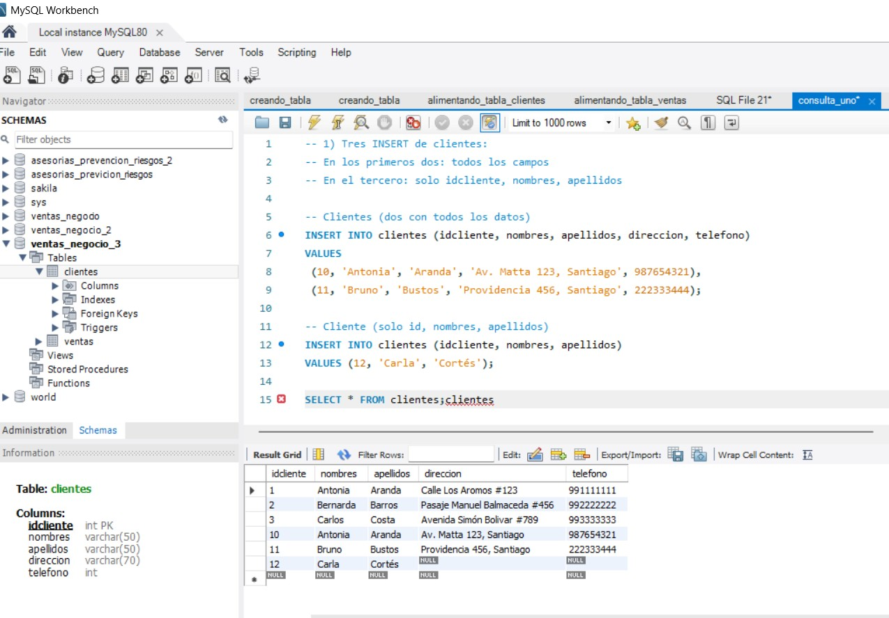
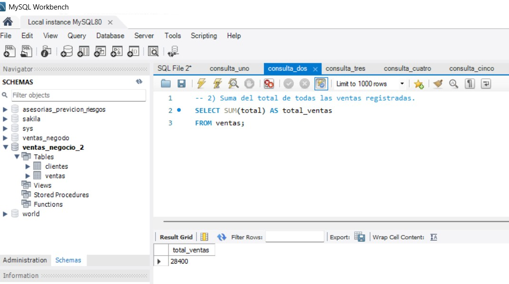
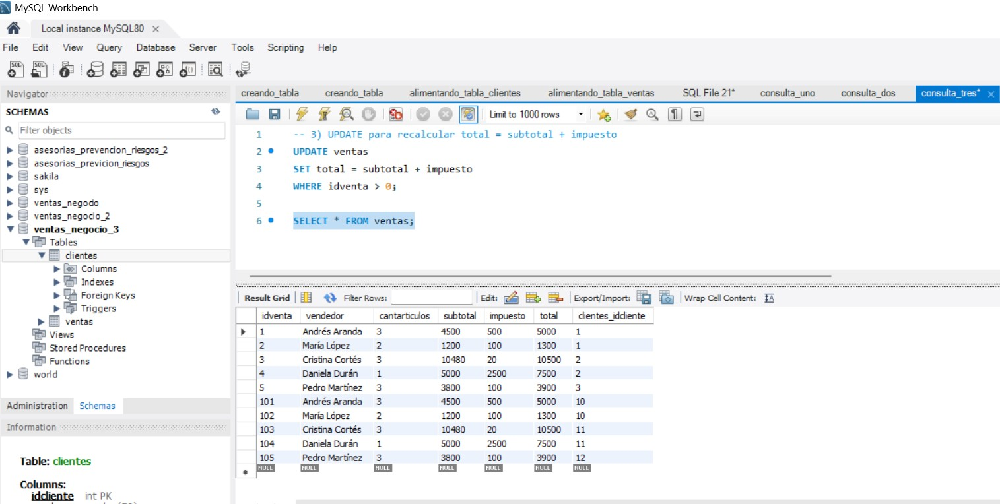
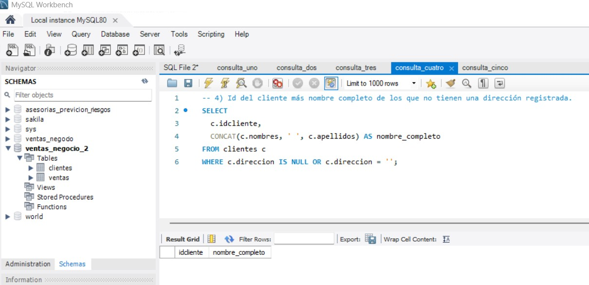
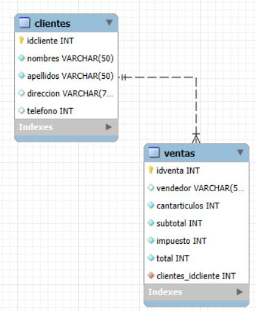

**_<h1 align="center">:vulcan_salute: Base de Datos Ventas Negocio Versión 2 :computer:</h1>_**


**<h3>:blue_book: Contexto de la Actividad:</h3>**

<p>Este ejercicio es la continuación de los ejercicios individuales del día anterior</p>
<p>Un negocio minorista desea llevar registro de las ventas diarias realizadas. Para ello ha creado el siguiente modelo de datos.</p>



**<h3>:orange_book: Requerimientos:</h3>**

<p>En un archivo de texto, agregue las siguientes consultas:</p>
<ul>
    <li>Genere tres consultas de inserción de clientes; en las primeras dos deben ir incorporados todos los datos, mientras que la restante debe estar considerado solo el identificador de cliente, nombres y apellidos.</li>
    <li>Genere cinco consultas de inserción de registros en la tabla ventas. No se pide un formato específico de consulta de inserción. Estas ventas deben estar asociadas lógicamente a alguno de los clientes antes creados.</li>
    <li>Genere una consulta que permita actualizar el campo total de la tabla ventas, igualándolo a la suma del subtotal y el impuesto.</li>
    <li>Finalmente, genere una consulta en la que se elimine un cliente a través de su identificador (idcliente), y posterior a eso otra consulta que elimine todas las ventas asociadas a dicho cliente (siempre de acuerdo con el campo idcliente).</li>
</ul>

**<h3>:green_book: Construcción de la Base de Datos:</h3>**

<p>Creando la base de datos con las tablas ventas y clientes:</p>

```SQL
CREATE TABLE clientes (
  idcliente INT PRIMARY KEY NOT NULL,
  nombres   VARCHAR(50) NOT NULL,
  apellidos VARCHAR(50) NOT NULL,
  direccion VARCHAR(70),
  telefono  INT
);

CREATE TABLE ventas (
  idventa INT PRIMARY KEY NOT NULL,
  vendedor VARCHAR(50),
  cantarticulos INT NOT NULL,
  subtotal INT NOT NULL,
  impuesto INT NOT NULL,
  total INT NOT NULL,
  clientes_idcliente INT NOT NULL
);

ALTER TABLE ventas
ADD CONSTRAINT ventas_clientes_fk 
FOREIGN KEY ( clientes_idcliente )
REFERENCES clientes ( idcliente );
```

<p>Alimentando la base de datos:</p>

```SQL
INSERT INTO clientes
 VALUES
 (1,'Antonia','Aranda','Calle Los Aromos #123',991111111),
 (2,'Bernarda','Barros','Pasaje Manuel Balmaceda #456',992222222),
 (3,'Carlos','Costa','Avenida Simón Bolivar #789',993333333);

INSERT INTO ventas (idventa, vendedor, cantarticulos, subtotal, impuesto, total, clientes_idcliente) 
VALUES
 (1, 'Andrés Aranda', 3, 4500, 500, 5000, 1),
 (2, 'María López', 2, 1200, 100, 1300, 1),
 (3, 'Cristina Cortés', 3, 10480, 20, 10500, 2),
 (4, 'Daniela Durán', 1, 5000, 2500, 7500, 2),
 (5, 'Pedro Martínez', 3, 3800, 100, 3900, 3);
```

**<h3>📁 Estructura del Proyecto:</h3>**

```
📁ventas_negocio_2
└── README.md
└── 📁img
│    ├── 📁wireframes
│    │    └── wireframe_bbdd.jpg
│    ├── consulta_uno.jpg
│    ├── consulta_dos.jpg
│    ├── consulta_tres.jpg
│    ├── consulta_cuatro.jpg
│    └── consulta_cuatro_con_registros.jpg
└── 📁mysql
    ├── eer_diagram.mwb
    ├── 📁consultas
    │   ├── consulta_uno.sql
    │   ├── consulta_uno_con_registros.sql
    │   ├── consulta_dos.sql
    │   ├── consulta_dos_con_registros.sql
    │   ├── consulta_tres.sql
    │   ├── consulta_tres_con_registros.sql
    │   ├── consulta_cuatro.sql
    │   └── consulta_cuatro_con_registros.sql
    ├── 📁tabla_clientes
    │   ├── alimentando_tabla_clientes.sql
    │   └── creando_tabla.sql
    └── 📁tabla_ventas
        ├── alimentando_tabla_ventas.sql
        └── creando_tabla.sql
```

**<h3>:blue_book: Consultas ejecutadas:</h3>**

1. Tres INSERT de clientes:
- En los primeros dos: todos los campos
- En el tercero: solo idcliente, nombres, apellidos
```SQL 
-- Clientes (dos con todos los datos)
INSERT INTO clientes (idcliente, nombres, apellidos, direccion, telefono)
VALUES 
 (10, 'Antonia', 'Aranda', 'Av. Matta 123, Santiago', 987654321),
 (11, 'Bruno', 'Bustos', 'Providencia 456, Santiago', 222333444);

-- Cliente (solo id, nombres, apellidos)
INSERT INTO clientes (idcliente, nombres, apellidos)
VALUES (12, 'Carla', 'Cortés');
```



2. Cinco INSERT de ventas (asociadas a esos clientes).
```SQL
INSERT INTO ventas (idventa, vendedor, cantarticulos, subtotal, impuesto, total, clientes_idcliente)
VALUES
 (101, 'Andrés Aranda', 3, 4500, 500, 5000, 10),
 (102, 'María López', 2, 1200, 100, 1300, 10),
 (103, 'Cristina Cortés', 3, 10480, 20, 10500, 11),
 (104, 'Daniela Durán', 1, 5000, 2500, 7500, 11),
 (105, 'Pedro Martínez', 3, 3800, 100, 3900, 12);
```


3. UPDATE para recalcular total = subtotal + impuesto
```SQL
UPDATE ventas
SET total = subtotal + impuesto
WHERE idventa > 0;
```


4. DELETE de un cliente y sus ventas asociadas:
- Manteniendo la FK actual (recomendado): borrar ventas → luego cliente
- Eliminar en ambas columnas por el id del cliente que quieras eliminar, ej: 12

```SQL
DELETE FROM ventas
WHERE clientes_idcliente = 12;

DELETE FROM clientes
WHERE idcliente = 12;
```


**<h3>:book: EER Diagram:</h3>**


